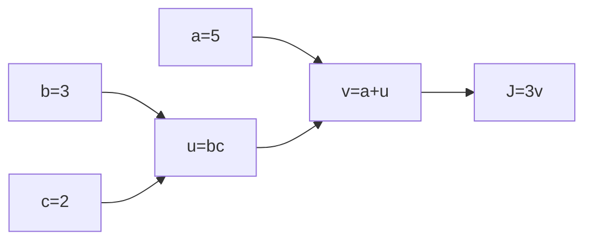
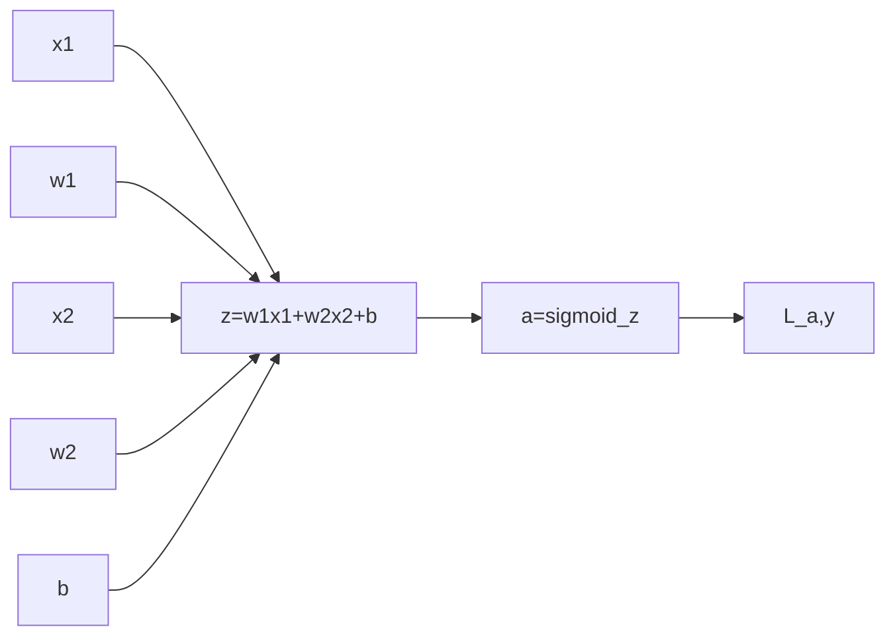

### Logistic Regression

* Given $x$, want $\hat y =  P( y = 1 | x )  (0 \leq \hat y \leq 1)$ and $x \in \mathbb{R^{n_x}}$

* Parameters: $w \in \mathbb{R^{n_x}}, b \in \mathbb{R}$
* Output $\hat y = \sigma(w^Tx+b)$

* Sigmoid function: $\sigma (z)=\frac{1}{1+e^{-z}}​$

  

***

### Logistic Regression cost function

* Given $\{(x^{(1)}, y^{(1)}),...,(x^{(m)}, y^{(m)}) \}$ , want $\hat y^{(i)} \approx y^{(i)}$

* Loss function: $\mathscr{L}(\hat y, y)=-ylog\hat y-(1-y)log(1-\hat y)$

* Cost function: $\mathscr{J}(w,b)=\frac{1}{m}\sum_{n=1}^N\mathscr{L}(\hat y^{(i)},y^{(i)})​$

***

### Gradient Descent

* Want to find $w,b​$ that minimize $\mathscr{J} (w,b)​$ 

* Repeat
  $$
  \begin{equation}
  w:=w-\alpha\frac{\partial\mathscr{J}(w,b)}{\partial w}
  \\
  b:=b-\alpha\frac{\partial\mathscr{J}(w,b)}{\partial b}
  \end{equation}
  $$

***

### Computational Graph

* In *python* a way to name a derivative of $\frac{d FinalOutput}{d var}$ simply as ==dvar==, because we already acknowledge the $dFinalOuput$ is the derivative of cost functions.

* Chain rule of derivative
  $$
  \begin{equation}
  da=\frac{dJ}{dv}\frac{dv}{da}
  \\
  db=\frac{dJ}{dv}\frac{dv}{du}\frac{du}{db}
  \\
  dc=\frac{dJ}{dv}\frac{dv}{du}\frac{du}{dc}
  \end{equation}
  $$
  

***

### Logistic Regression derivatives

$$
\begin{equation}
da=\frac{d\mathscr{L}(a,y)}{da}=-\frac{y}{a}+\frac{1-y}{1-a} \\
dz=\frac{\mathscr{J}(a,y)}{dz}=\frac{d\mathscr{L}}{da}\frac{da}{dz}=a-y \\
dw_1=\frac{\partial\mathscr{J}}{\partial w_1}=x_1dz\\
dw_2=\frac{\partial\mathscr{J}}{\partial w_2}=x_2dz\\
db=\frac{\partial\mathscr{J}}{\partial b}=dz

\end{equation}
$$

***

### Logistic Regression on m examples

* In examples $(x^{(i)},y^{(i)})$, calculate $dw_1^{(i)}, dw_2^{(i)}, db^{(i)}$  
  $$
  \begin{equation}
  \frac{\partial}{\partial w_i}\mathscr{J}(w,b)=\frac{1}{m}\sum_{i=1}^m\underbrace{\frac{\partial}{\partial w_i}\mathscr{L}(a^{(i)},y^{(i)})}_{dw_i^{(i)}}
  \end{equation}
  $$
  

